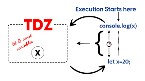

# What is a scope in js ?
>What is a scope in js ?
The scopeisthecurrentcontextofexecutioninwhichvaluesandexpressions
are"visible" orcanbereferenced. Ifa variableorexpressionisnotinthecurrent
scope, itwillnotbeavailableforuse. Scopescanalsobelayeredina hierarchy,
sothatchildscopeshaveaccesstoparentscopes, butnotviceversa.
JavaScript has the following kinds of scopes:
•Global scope: The default scope for all code running in script mode.
•Function scope: The scope created with afunction.
Block scope: This scope restricts the variable that is declared
inside a specific block, from access by the outside of the block.
•Module scope: The scope for code running in module mode.

# The 3 types of scope
>JavaScript has 3 types of scope:
Block scope.
Function scope.
Global scope.

# The scope chain
>Whenever a variable is used, the JavaScript interpreter traverses the scope chain until it finds an entry for that variable. Traversal on the scope chain always starts in the most immediate scope and moves towards the global space.

# Hoisting in javascript
>Hoisting isa JavaScript mechanism where variables and function
declarations are moved to the top of their scope before code
execution.
Hoisting in JavaScript isa behavior in which a function or a variable
can be used before declaration.

# Hoisting –Variable(var)
>Hoi s t ing –Var iable(var )
There’s a temptation to think that all of the code you see in a
JavaScript
program is interpreted line-by-line, top-down in order, as the program
execute. While that is essentially true, there’s one part of that as‐
assumption that can lead to incorrect thinking about your program.
.png)
# Hoisting – function declaration
>So, one way of thinking, sort of metaphorically, about this process, is that variable and
The function foo’s declaration (which in this case includes the implied value of it as an
actual function) is hoisted, such that the call on the first line is able to execute
function
declarations are “moved” from where they appear in the flow of the code to the top of
the code. This gives rise to the name hoisting.

# Temporal dead zone, letand const
>The temporal dead zone (TDZ) is a specific period in the execution of JavaScript code where variables declared with let and const exist but cannot be accessed or assigned any value. During this phase, accessing or using the variable will result in a ReferenceError .

# Thanks for watching!
